# Contamination Reject Pattern Analysis Tool

> A manufacturing data-analysis application for screening localized contamination patterns and detecting changes in spatial reject behaviour.

## Why This Tool?

Particle contamination is a yield concern for the MEMS device investigated in this project. The packaging process has strict requirements regarding particle presence, so contamination can result in rejected units and contribute to yield loss. Understanding how these rejects occur and where they are distributed is therefore important for engineering investigation.

Identifying the contamination root cause requires more than simply reviewing the rejects. Engineers need to understand the spatial behaviour of the rejects — whether they are randomly distributed, concentrated, or follow a specific pattern.

### Why Is This Difficult in Production?

For a small engineering lot, engineers can manually inspect strip maps and look for suspicious spatial patterns.

The challenge becomes much greater at production scale.

A production batch can involve **100 - 200 strips**, resulting in a large number of strips and reject locations. Manually reviewing the full population of strip maps makes it difficult to determine efficiently which locations deserve closer engineering attention.

  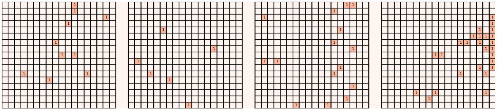
   
  <i>Example of a strip map. At production scale, the large number of strips makes manual pattern inspection difficult.</i>

The problem is therefore not only:

> **How much yield loss occurred?**

but also:

> **Where are the important reject patterns, and which areas should be investigated?**

Contamination behaviour can also change over time. A current production lot may develop a spatial pattern that was not commonly observed in previous production.

This leads to two practical engineering questions:

### 1. Where Should I Look?

When many rejects are present, which spatially concentrated patterns are important enough to prioritize for investigation?

> **Which localized reject patterns are important enough to prioritize for investigation?**

### 2. What Has Changed?

Compared with historical production, has the current lot developed a different particle reject pattern, and where is the difference concentrated?

> **Which parts of the current spatial pattern are different from historical production?**

These two questions form the basis of the **Contamination Reject Pattern Analysis Tool**.

---

## What Is This Tool?

The **Contamination Reject Pattern Analysis Tool** is a data-analysis application designed to use spatial information from production reject data to help engineers:

- identify important localized reject patterns,
- compare current spatial behaviour with historical production,
- locate regions contributing to a detected pattern difference,
- identify focused strips or areas for further investigation.

The tool provides a common workflow from raw production data to spatial analysis and engineering investigation.

It is not intended to replace engineering judgment. Instead, it acts as a **screening and prioritization layer** between large-scale production data and detailed investigation such as physical inspection, SEM/EDX analysis, and process troubleshooting.

## Without spatial analysis:

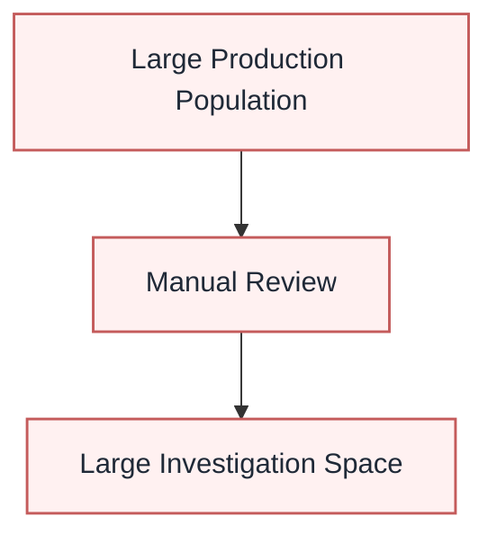

## With the analysis tool:

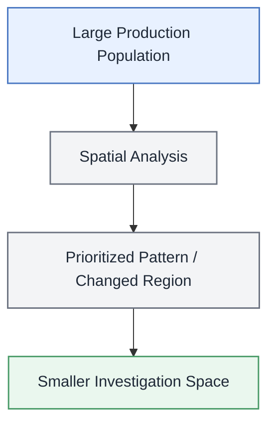

## Two Analysis Paths

### Analysis Path 1 — Find Where to Look

#### Engineering Question

> **Which localized reject patterns should be reviewed first?**

In production, a large number of strips may contain rejects, making it time-consuming to manually inspect each strip map for localized patterns.

This analysis uses **DBSCAN clustering** to quickly identify localized concentrations of reject points within each strip. The detected clusters are visualized directly on the strip map, allowing engineers to see the location and shape of each localized pattern.

The clusters are then ranked by **cluster size**, so larger reject concentrations can be reviewed first.

The purpose is not to prove that a detected cluster represents a contamination source. Instead, the method provides a **fast screening mechanism for localized reject patterns**, helping engineers identify where to start rather than manually searching through every strip.

  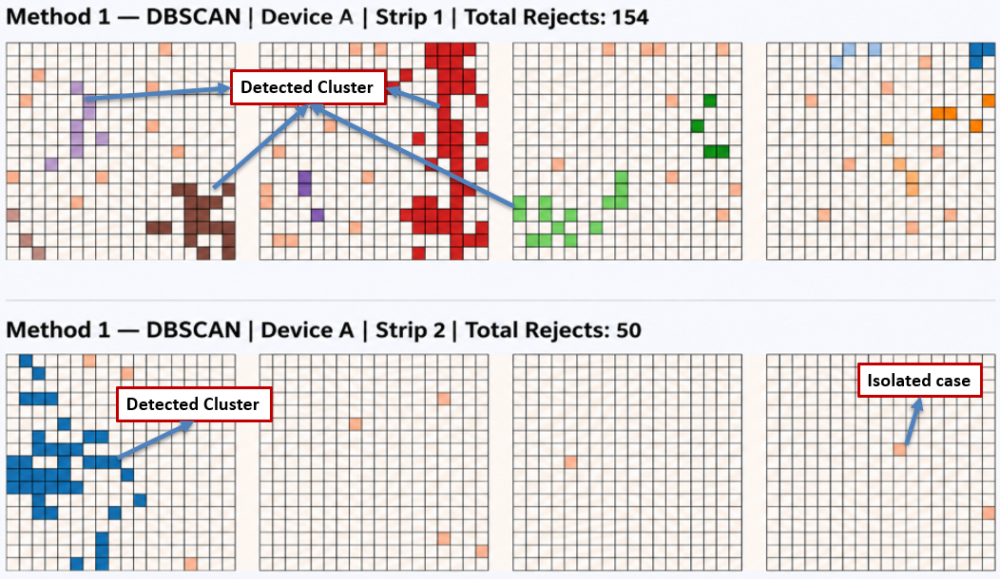
   
  <b>Example of a DBSCAN result.</b> 
  Detected clusters are highlighted on the strip map and ranked by cluster size to support faster review.

### Analysis Path 2 — Find What Changed

#### Engineering Question

> **Has the current production lot developed a different particle reject pattern compared with historical production?**

This analysis compares the spatial distribution of a current production population with a historical reference population.

Both populations are converted into the same spatial representation so that their reject distributions can be compared consistently.

**Jensen-Shannon Divergence (JSD)** is used to quantify the difference between the two spatial probability distributions.

The analysis also examines the contribution from individual spatial regions to localize the observed difference.

A permutation test is used to assess whether the observed difference is larger than would be expected from random grouping.

This comparison can also be used to **monitor the effectiveness of improvement actions**. Some particle reject types may have characteristic spatial preferences, such as concentrating near the edge of a strip. By comparing the spatial pattern before and after an improvement action, engineers can monitor whether the characteristic reject pattern becomes less prominent or disappears in subsequent production. This provides an additional indication of whether the improvement action has changed the observed contamination behaviour.

  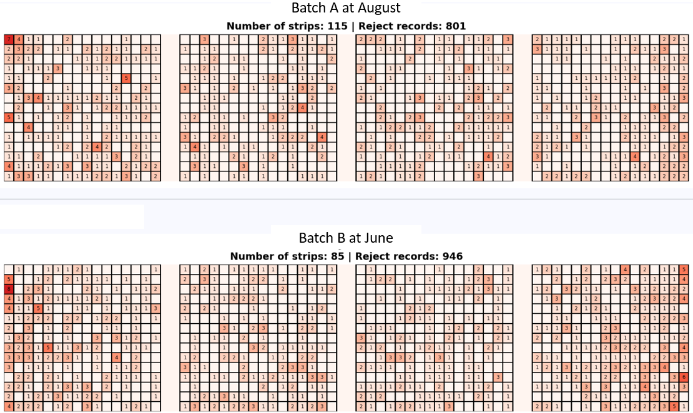
   
  <b>1. Input — Historical and Current Production</b> 
  Strip maps from the two production populations provide the reference and current patterns for comparison.

↓

  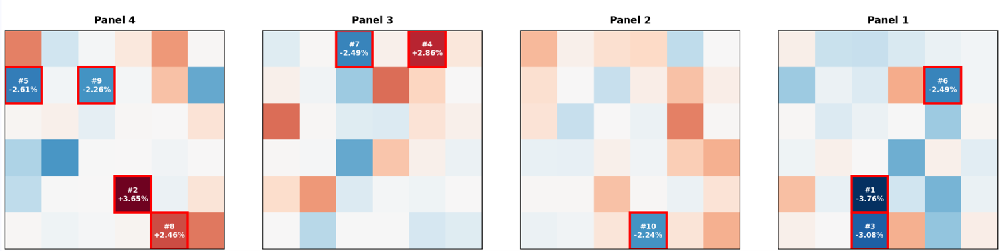
   
  <b>2. Method 2 Result — Spatial Pattern Difference</b> 
  JSD quantifies the overall spatial pattern difference, while the result highlights regions that contribute more strongly to that difference.

↓

  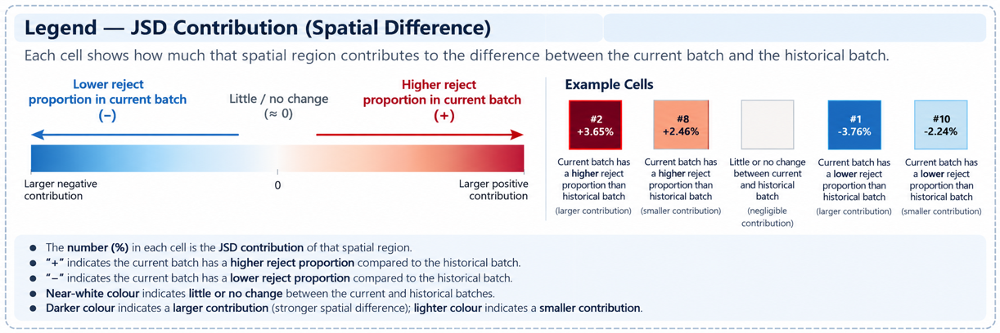
   
  <b>3. Result Legend — Interpreting the Pattern Difference</b> 
  The legend shows how the spatial contribution values should be interpreted.

## The Two Questions

The two methods can be summarized as:

| Engineering Question | Analysis Approach |
|---|---|
| **Which localized reject patterns deserve attention?** | DBSCAN spatial clustering |
| **Has the current spatial behaviour changed compared with historical production?** | Historical pattern comparison |

The two methods are therefore complementary rather than interchangeable.

---

## Analysis Pipeline

Both analysis paths share a common data workflow from production data to focused engineering investigation.

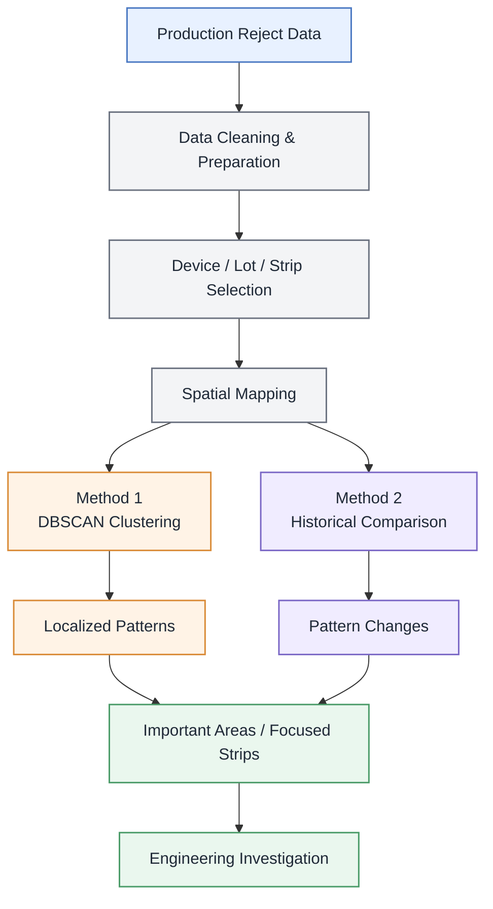

## Technical Background

The tool is developed in Python to analyze production reject patterns using spatial analysis and statistical comparison techniques.

The overall workflow is:

```mermaid
flowchart LR
    A[Raw Production Data] --> B[Data Preparation]
    B --> C[Data Selection]
    C --> D[Spatial Data Preparation]
    D --> E[Analysis Method]
    E --> F[Results & Visualization]
    F --> G[Export]

    classDef input fill:#E8F1FF,stroke:#4A78C2,stroke-width:1.5px,color:#1F2937;
    classDef process fill:#F3F4F6,stroke:#6B7280,stroke-width:1.5px,color:#1F2937;
    classDef output fill:#EAF7EE,stroke:#4A9B68,stroke-width:1.5px,color:#1F2937;
    class A input;
    class B,C,D,E,F process;
    class G output;
```

### Data Preprocessing

The raw production data is first cleaned and prepared for analysis.

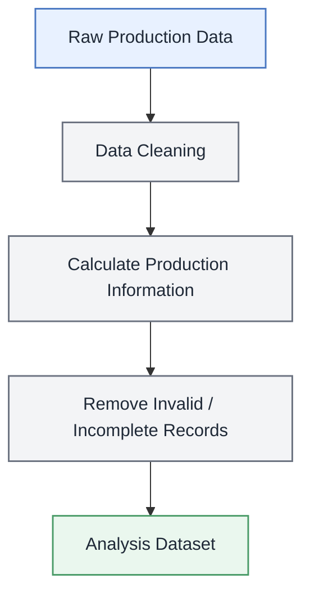

The prepared data is then filtered according to the selected device, date range, lot, or batch.

### Data Preparation

After the analysis population is selected, the production coordinates are transformed according to the device configuration and converted into a common spatial representation.

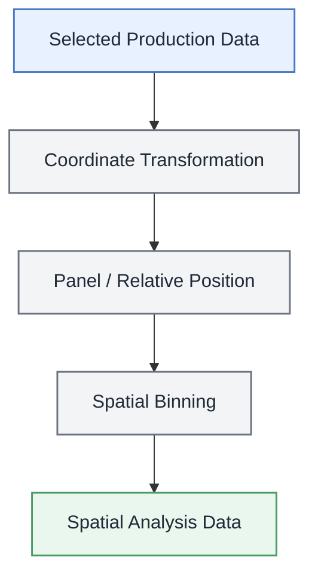

This allows reject locations to be analyzed based on their spatial distribution rather than only their total quantity.

### Analysis Methods

The application provides two complementary analysis approaches.

### Method 1 — DBSCAN Clustering

DBSCAN is used to identify localized groups of reject locations.

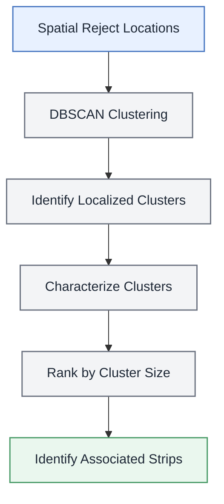

This method focuses on quickly finding localized reject patterns and prioritizing larger clusters for review.

### Method 2 — Batch Spatial Comparison

This method compares the spatial reject distribution between a reference population and a current population.

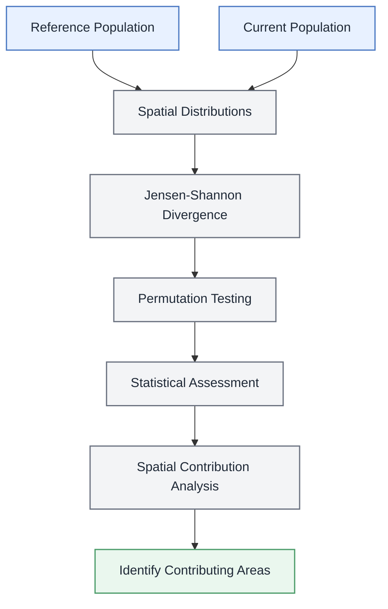

#### Jensen-Shannon Divergence

Jensen-Shannon Divergence (JSD) measures the difference between the reference and current spatial probability distributions.

A larger JSD indicates a greater difference between the two spatial distributions.

#### Permutation Testing

Permutation testing evaluates whether the observed JSD is larger than would be expected from random grouping of the available strips.

The observed JSD is compared with a distribution of JSD values generated from randomized groupings.

#### Spatial Contribution Analysis

When a spatial difference is detected, the overall JSD is further examined at the spatial-bin level.

This identifies the spatial regions that contribute most to the observed difference.

### Application Workflow

The complete application workflow is:

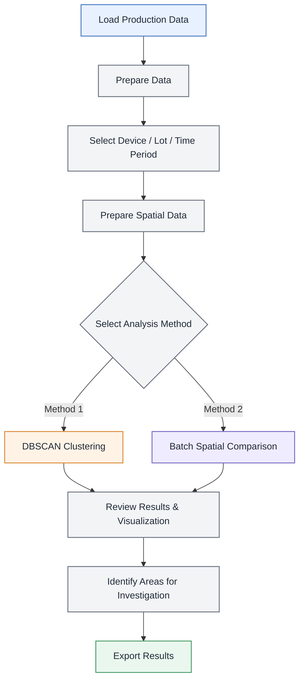

  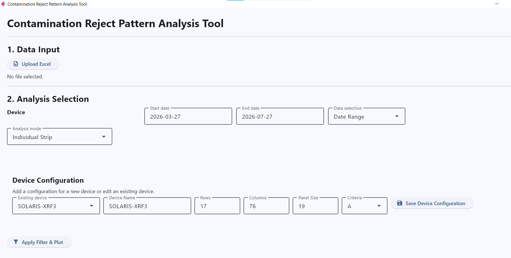
   
  <i>The application integrates the workflow into a single graphical interface, allowing production reject patterns to be analyzed without manually executing individual Python scripts.</i>

